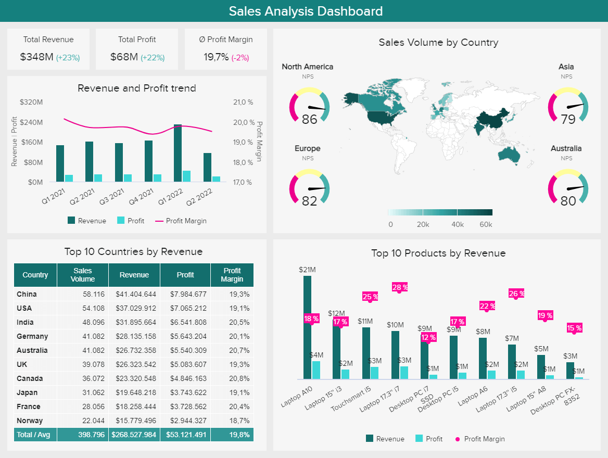

# FCB-PROJECT
## DESCRIPTION

This projects aims to analyze sales in a foam production company using data to identify the patterns,trends, and factors contributing to the flunctuation in sales


## Data Sources
- **Google forms**
- **Questionnaire**
- **Sales record**

## Tools Used
- **Ms Excel [Download Here](https://microsoft.com)**
- **Python**
- **Power BI**


```
Google Query Sheet

SELECT *FROM TABLE 1
WHERE CONDITION = MET

```

## Result
|Name|Gender|Age|Sales per year|
|----|------|----|-------|
|Onaopemipo|Male|23|50|
|Seun|Male|27|40|
|Joshua|Male|55|06|
|Doyin|Female|25|40|


